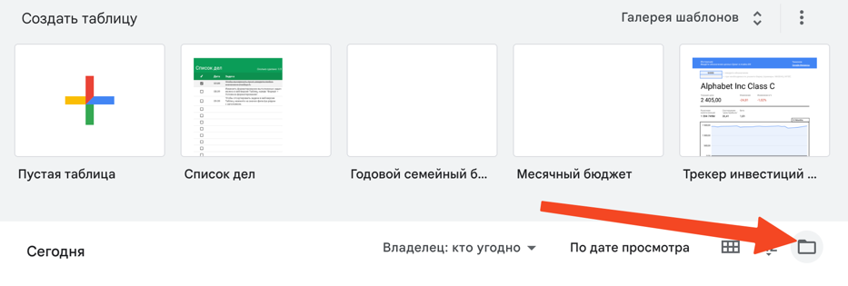
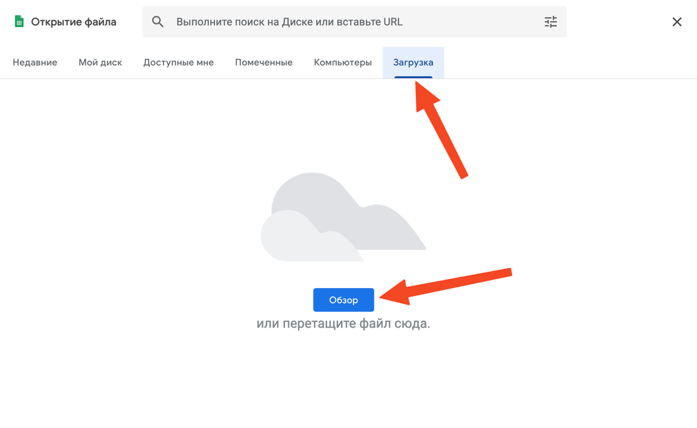
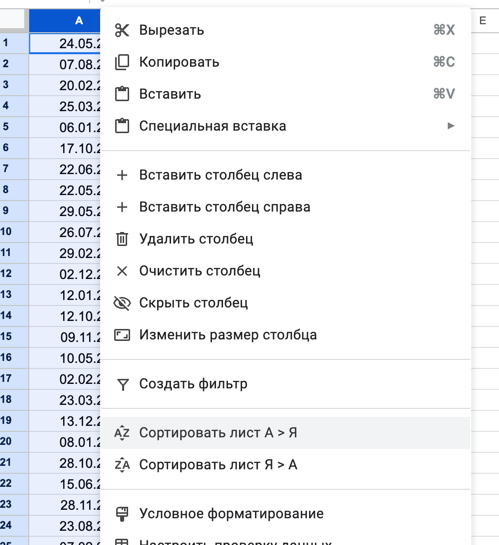
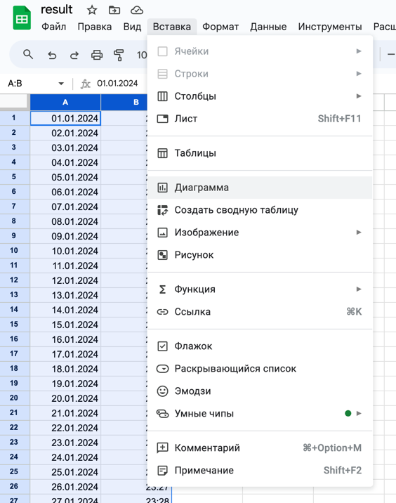

# Полночь

По мнению некоторых ученых время ночного намаза заканчивается в полночь
и ночной намаз, совершенный после полуночи считается возмещенным.
А полночь в свою очередь определяется как середина между временем вечернего азана и утреннего.

Эта программа подсчитывает время полуночи для заданного года в заданной местности.

## Как использовать?

1. Создаем в корне файл `config.json` и заполняем:
    ```jsonc
    {
      "latitude": 21.422512,  // широта вашей местности
      "longitude": 39.82618,  // долгота вашей местности
      "year": 2024,
      "outputCSV": "Midnight.csv"
    }
    ```

2. Теперь запускаем: `make run`.

3. На этом полномочия данного кода все, теперь идем в гугл таблицы:
   https://docs.google.com/spreadsheets/

4. Тыкаем сюда:
   

5. Потом сюда:
   

6. Выбираем выходной файл программы
   (если ничего не меняли, то он в папке с кодом: `Midnight.csv`)

7. Теперь сортируем даты от А до Я:
   

8. Выбираем столбцы с данными (A и B), нажимаем "вставка", потом "диаграмма":
   

9. Готово.
